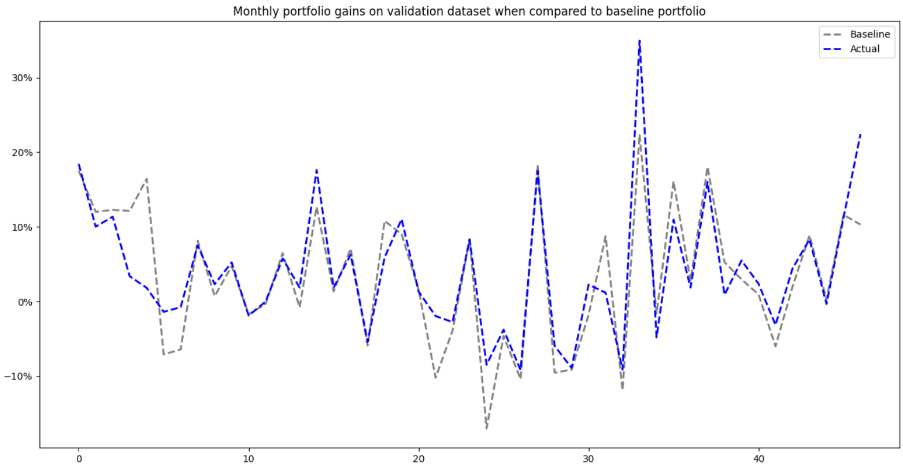
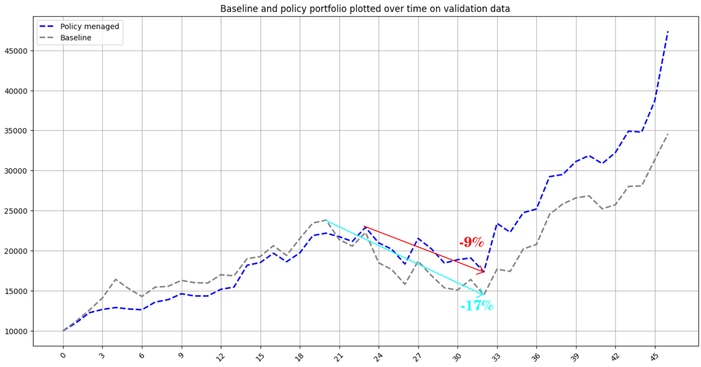

# PCS-Reinforcement-Learning-for-Portfolio-Optimization
Simple RL model epxloration for portfolio optimization problem on small amount of chosen stocks.

## Installation

Created using Python 3.11.8

To use the jupyer notebooks install requiremnets using:

`pip install -r requirements.pip`

_note: torch version is cpu in requirements, it's advised to install version with gpu acceleration to facilitate faster training._

## Description

The idea behind this project was to create a stock market simulation evironment and then apply a reinforcement learning agent to it to learn ot efficently menage the stocks in the portfolio.

The agent network was a deep learning network, the algorithm itself is based on Proximal Policy Optimization (PPO) algorithm by [Schulman et al. (2017)](https://arxiv.org/abs/1707.06347).

## Results

Some example results include portfolio managed by a trained model that was compared to a baseline portfolio which simply held uniformly distributed stocks. Here the model was trianed on 4 stocks (NVDA, MSFT, AAPL, AMZN), additionally model was allowed to also allocate portfolio to cash.

When compared on validation dataset, the model outperformed the baseline portfolio both in cumulative return (457% agains 306% on validation dataset) as well as on monthly gains basis as seen on figure below:

Admittibly the model learned to menage portfolio quite well whenever the particularly considered part of tyhe market turne bearish as it menaged to reduce losses most of the time when compared to the baseline portfolio, additionally the model learned to also amplify gians on some months.

Sharpe ratio of the portfolio managed by the model was S = 0.418 while sharpe ratio of the baseline portfolio was S = 0.329 showing that the model was also better on this basis.

Additionally maximum draw down of the portfolio menaged by the model also seemded to be less than baseline being only -9% while the baseline portfolio had a maximum draw down of -17%:

All of this shows that the model learned to perform proper portfolio optimization task on 4 chosen stocks despite being only trained on the basis of rewards calculated as monthly change of portfolio value and being having quite a simple architecture overall.